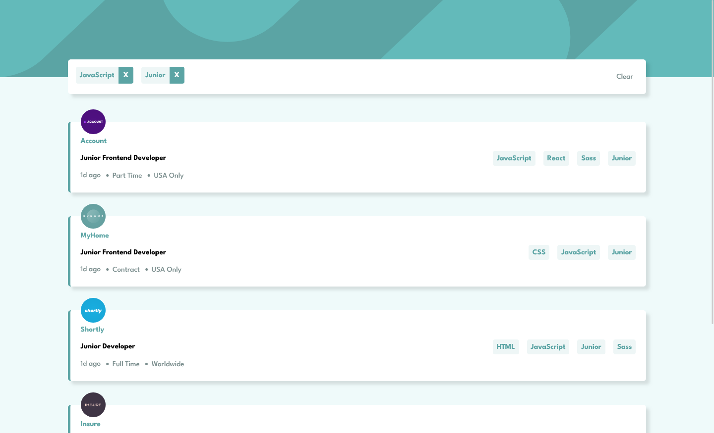
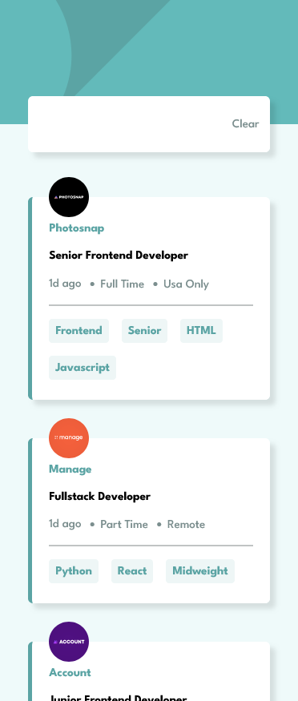

# Frontend Mentor - Job listings with filtering solution

This is a solution to the [Job listings with filtering challenge on Frontend Mentor](https://www.frontendmentor.io/challenges/job-listings-with-filtering-ivstIPCt). Frontend Mentor challenges help you improve your coding skills by building realistic projects. 

## Table of contents

- [Overview](#overview)
  - [The challenge](#the-challenge)
  - [Screenshots](#screenshots)
  - [How To Use](#how-to-use)
- [My process](#my-process)
  - [Built with](#built-with)
  - [What I learned](#what-i-learned)


## Overview

### The challenge

Users should be able to:

- View the optimal layout for the site depending on their device's screen size
- See hover states for all interactive elements on the page
- Filter job listings based on the categories

### Screenshots




### How To Use

Clone and run this application, you'll need [Git](https://git-scm.com) and [Docker](https://www.docker.com/) From your command line:

```bash
# Clone this repository
$ git clone https://github.com/LarsWeyen/job-listings.git

# Go into the repository
$ cd job-listings

# Build and start all services defined in docker-compose.yml
$ docker compose up --build

# If you want live changes in the browser open a new terminal:
$ docker compose watch
```

## My process

### Built with

- Semantic HTML5 markup
- CSS custom properties
- Flexbox
- CSS Grid
- Mobile-first workflow
- [Vue](https://vuejs.org/) - JS Framework
- [ASP .NET Core 6.0](https://dotnet.microsoft.com/en-us/apps/aspnet) - Web Api
- [PostgreSQL](https://www.postgresql.org/) - Database
- [Docker](https://www.docker.com/) - Containerization

### What I learned

This project served as a learning ground for mastering Docker Compose. I particularly focused on understanding how to define multi-container applications, set up database connections, and manage service dependencies within Compose. Initially, connecting the API and PostgreSQL database presented a challenge, but by leveraging Compose's networking features and environment variable configuration, I established a smooth communication channel.

By containerizing the application, I achieved several advantages:

- **Portability:** The project can be easily deployed on different systems with minimal configuration changes.
- **Reproducibility:** Consistent development and production environments guarantee identical behavior.
- **Scalability:** Scaling individual services becomes simpler due to their isolated nature.
- **Development workflow:** Docker Compose streamlines builds and startup processes, making development more efficient.

Starting the project now requires only a single command (`docker compose up`), demonstrating the power and convenience of containerization.

